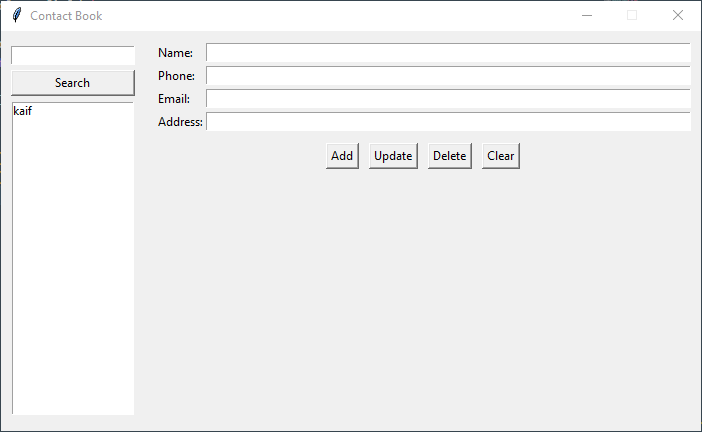

<h1 align="center"> 📒 Contact Book (Tkinter) </h1>


A simple and user-friendly **Contact Book application** built with
**Python (Tkinter GUI)**.<br>
It allows you to **Add, Update, Delete, Search, and Save contacts** with
details like Name, Phone, Email, and Address.

------------------------------------------------------------------------

## 🚀 Features

-   ➕ **Add new contacts** with details.
-   ✏️ **Update existing contacts** easily.
-   ❌ **Delete unwanted contacts** with confirmation.
-   🔍 **Search contacts** by name.
-   💾 **Persistent storage** -- contacts are saved in `contacts.json`.
-   ✅ Input validation for phone numbers and emails.
-   🖥️ Simple and clean GUI using **Tkinter**.

------------------------------------------------------------------------

## 🛠️ Requirements

-   Python **3.6+**
-   No external libraries required (uses only built-in modules:
    `tkinter`, `json`, `os`, `re`).

------------------------------------------------------------------------

## ▶️ How to Run

1.  Clone or download this repository.

2.  Make sure Python is installed.

3.  Run the program:

    ``` bash
    python main.py
    ```

4.  A GUI window will open where you can manage your contacts.

------------------------------------------------------------------------

## 📂 Project Structure

    📁 ContactBook
     ┣ 📜 main.py          # Main program (GUI & logic)
     ┣ 📜 Screenshot       # Preview
     ┣ 📜 contacts.json    # Auto-generated file to store saved contacts
     ┗ 📜 README.md        # Project documentation

------------------------------------------------------------------------

## 📸 Screenshots




------------------------------------------------------------------------

## 👤 Author

**Made by Kaif Tarasagar**
- 🔗 [LinkedIn](https://www.linkedin.com/in/kaif-tarasgar-0b5425326/)
- 🐦 [Twitter (X)](https://x.com/Kaif_T_200)
